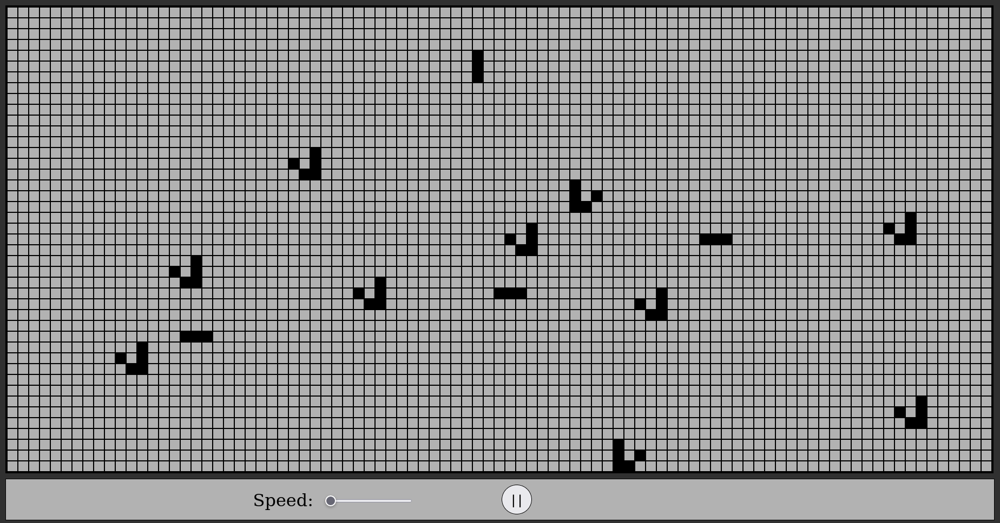

  
  

## Web application based on John Conway's Game of life

  

## :link: Table of Contents
*  [:page_with_curl: General Information](#page_with_curl-general-information)
*  [:heavy_check_mark: Rules](#heavy_check_mark-rules)
*  [:camera_flash: Screenshots](#camera_flash-screenshots)
*  [:old_key: Features](#old_key-features)
*  [:bookmark_tabs: Resources](#resources)
*  [:bulb: Ideas](#bulb-ideas)

  

## :page_with_curl: General Information
Game of Life is created by the mathematician John Conway in 1970, which is a zero-player game - the next evaluation of the game will be determinted by the previous state. That means the game start from one initial state. The game is simulation itself, meaning that it evolves over time and creates some kind of world of beings with specific kind of [rules](#heavy_check_mark-game-rules).

When the initial state is set the simulation begins with applying the rules in the same time on all "beings", or in our case cells. The inital state is set, evaluated with all inital values and at the end is set as end state for this generation and new state for the next one.

  

## :heavy_check_mark: Game Rules
1. Any live cell with fewer than two live neighbours dies, as if by underpopulation.
2. Any live cell with two or three live neighbours lives on to the next generation.
3. Any live cell with more than three live neighbours dies, as if by overpopulation.
4. Any dead cell with exactly three live neighbours becomes a live cell, as if by reproduction.
5. Any dead cell with three live neighbours becomes a live cell.
6. All other live cells die in the next generation. Similarly, all other dead cells stay dead.

  

## :camera_flash: Screenshots

  

## :old_key: Features
* #### Initialization of initial state and simulation
* #### Speed control
* #### Pause/Play button

  

## :bookmark_tabs: Resources
- [Wikipedia publication for Conways's Game of Life ](https://en.wikipedia.org/wiki/Conway%27s_Game_of_Life)
- [Online playable Game of Life](https://playgameoflife.com/)
- [YouTube Video with John Conway](https://www.youtube.com/watch?v=R9Plq-D1gEk)

## :bulb: Ideas
- Grid resize option(scale)
- Allow users to move around the grid
- Download the current generation state
- Upload download states